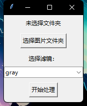
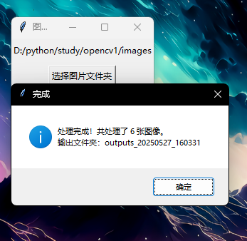

# 🖼️ Image Filter GUI

一个交互式图像处理小工具，内置图形界面，支持以下功能：

- 灰度转换
- 高斯模糊
- 边缘检测
- 图像亮度增强（可调节）
- 图像对比度增强（可调节）

📌 本项目适合作为初学者入门图像处理与 Python GUI 编程的练习项目，尤其适合用于展示基本 OpenCV 和 Tkinter 的综合应用能力。
用户可以通过简单的按钮点击，即可对图片进行批量处理和增强，**无需任何编程基础！**

---

## 📸 项目演示

主界面截图：



处理结果截图：



---

## 📁 项目结构
```
Image Filter GUI/
├── filters.py   # 各种图像处理函数
├── gui_app.py   # 主界面程序
├── images/      # 输入图像文件夹
├── outputs_xxx/ # 输出图像（带时间戳）
├── screenshots/ # 存放 README 截图
└── README.md
```
## 💻 使用方法

1. 安装依赖（建议使用虚拟环境）：

```bash
pip install -r requirements.txt

2.启动程序：
python gui_app.py

3.选择图像并应用滤镜，自动保存输出！
## ✅ 未来可扩展功能

- [ ] 添加图像浏览器
- [ ] 添加更多滤镜（浮雕、锐化等）
- [ ] 视频处理功能
- [ ] 保存滤镜参数配置

## 🕘 开发日志

- 2025-05-26：完成基础图像处理功能（灰度、模糊、边缘）
- 2025-05-27：增加亮度/对比度增强功能 + 图形界面